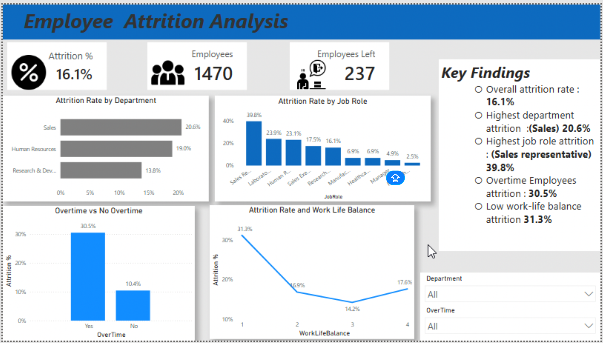
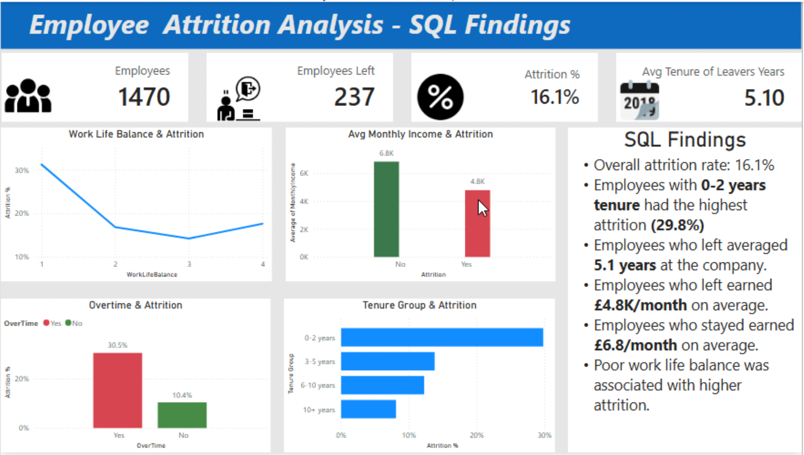

# Employee Attrition Analysis (SQL + Power BI)
***Skills:*** SQL │ PostgreSQL │ Power BI │ DAX │ Data Visualisation │ HR Analytics

## Project Overview 
This project investigates employee attrition using PostgreSQL and Power BI. SQL was used to analyse workforce data and identify key drivers of employee turnover before visualising the findings in an interactive Power BI dashboard. 

## Tools Used 
- PostgreSQL
- SQL
- Power BI
- DAX
- Github

## Business Questions
The analysis aimed to answer the following questions:
- What is the overall employee attrition rate?
- Which department has the highest attrition?
- Which job role experiences the highest employee turnover?
- Does overtime contribute to attrition?
- Does work-life balance influence employee retention?
- How does employee tenure affect attrition?
- Is there a relationship between salary and attrition?

  ## SQL Analysis
  The following SQL analyses were performed:
  - Overall attrition Rate
  - Attrition Count by Department
  - Attrition Rate by Department
  - Attrition by Job Role
  - Overtime Attrition Analysis
  - Work-life Balance and Attrition
  - Average Monthly Income by Attrition status
  - Average Years at Company for Leavers
  - Attrition by Tenure Group
 
  ## Key Findings
   - Overall attrition rate was **16.1%**
   - The **Sales** department recorded the highest attrition rate (**20.6%**)
   - **Sales Representatives** had the highest attrition rate (**39.8%**)
   - Employees working overtime experienced attrition of **30.5%**, compared to **10.4%** for employees who did not work overtime
   - Employees with **0-2 years tenure** experienced the highest attrition rate (**29.8%**)
   - Employees who left the company averaged **5.1 years tenure**
   - Employees who left earned an average monthly income of approximately **£4.8k**, compared with **£6.8k** for employees who remained
   - Lower work-life balance scores were associated with higher attrition rates

  ### Power BI dashboard
  Provides a high level overview of attrtition across departments, job role, overtime status and work-life balance.
  ### Main Dashboard
  

  ### SQL + Power BI dashboard
  Presents additional insights generated through SQL analysis, including tenure group, average salary comparison and employee tenure metrics.
  ### SQL Findings
  

  ## Repository Contents
 -  SQL Queries(.sql)
 - Power BI Dashboard (.pbix)
 - Dashboard Screenshots
 - README Documentation

  ## Conclusion
  The analysis suggests that overtime, lower salaries, poor work-life balance and shorter employee tenure are strongly associated with higher attrtion rates. These insights can help HR teams identify retention risks and develop targeted employee retention strategies and improve workforce stability.
  

